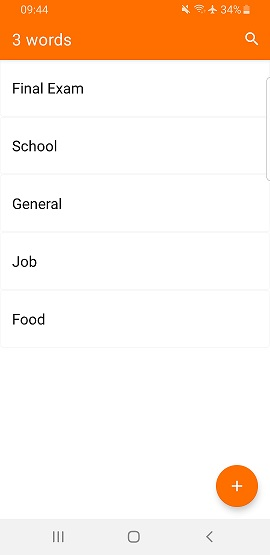
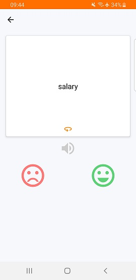

# Dictionary Maker

An app for learning English. The user can 
- add vocabulary 
- sort it into categories
- use flash cards to learn the words 
- view the total number of words learned

### Screenshots

### Dependencies

    //UI
    implementation 'com.google.android.material:material:1.3.0-rc01'
    implementation "com.airbnb.android:lottie:3.4.0"
    implementation 'it.xabaras.android:recyclerview-swipedecorator:1.2.3'

    //Koin
    implementation "org.koin:koin-core:2.2.0"
    implementation 'org.koin:koin-android:2.2.0'
    implementation 'org.koin:koin-android-viewmodel:2.2.0'
    implementation 'org.koin:koin-androidx-scope:2.0.1'

    //Room
    implementation "androidx.room:room-runtime:2.2.6"
    annotationProcessor "androidx.room:room-compiler:2.2.6"
    kapt "androidx.room:room-compiler:2.2.6"
    implementation "androidx.room:room-ktx:2.2.6"

    implementation 'com.android.support:multidex:1.0.3'

    //Coroutines Dependencies
    implementation "org.jetbrains.kotlinx:kotlinx-coroutines-android:1.3.7"
    implementation 'org.jetbrains.kotlinx:kotlinx-coroutines-core:1.3.7'
    implementation 'org.jetbrains.kotlinx:kotlinx-coroutines-play-services:1.2.1'

    //lifecycle
    implementation 'androidx.lifecycle:lifecycle-viewmodel-ktx:2.2.0'
    implementation 'androidx.lifecycle:lifecycle-livedata-ktx:2.2.0'
    implementation "androidx.lifecycle:lifecycle-extensions:2.2.0"
    implementation "androidx.lifecycle:lifecycle-common-java8:2.2.0"

## Built With

- Koin 
- Live Data 
- Coroutines 
- MVVM 
- Room 
- View Binding

